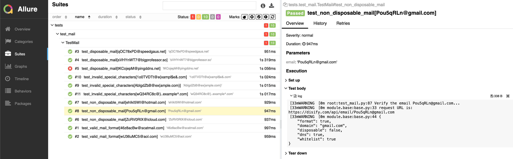

# DISIFY API Test

- This repo is for testing DISIFY GET API for email verification

- website https://www.disify.com/

- document https://docs.disify.com/

## Test Cases

1.test_valid_mail_format

- Random generate conform to valid email format

  - username: random join ascii_letters and digits

  - domain: using disposable_domains and real_domains

- Expected all return format should be `True`

2.test_disposable_mail

- Random generate conform to valid email format using disposable_domains

  - username: random join ascii_letters and digits

  - domain: using disposable_domains

    - Using a package [disposable-email-domains](https://pypi.org/project/disposable-email-domains/) to get disposable-email list as test data

- Expected all return format should be `True` and  disposable should be `True`

3.test_non_disposable_mail

- Random generate conform to valid email format using real_domains

  - username: random join ascii_letters and digits

  - domain: using real_domains

- Expected all return format should be `True` and  disposable should be `False`

4.test_invalid_special_characters

- Random generate some invalid special characters in domain base on "RFC 5322"

  - username: random join ascii_letters and digits

  - domain: random join special_characters in "example.com"

- Expected all return format should be `False`

note: all test data are random generate and using lambda and Pytest parametrize to make variety

### Test result

- 

note: one case failed might due to the domain shouldn't be on the blocklist.